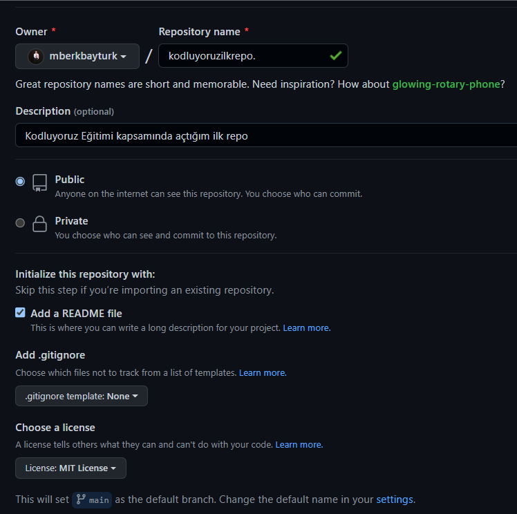

# Kodluyoruz İlk Repo

Bu repo [Kodluyoruz](https://www.kodluyoruz.org/) Front-End Eğitiminde oluşturduğumuz ilk repo. İçerisinde bir adet README dosyası, bir adet de index.html barındırıyor.

# Installation

Öncelikle projeyi clonelayın.

`
git clone https://github.com/mberkbayturk/kodluyoruzilkrepo.git
`

# Usage

Projeyi cloneladıktan sonra Visual Studio Code programında açınız.

Linux için:

`
cd kodluyoruzilkrepo
code .
`

# Contributing

Pull requestler kabul edilir. Büyük değişiklikler için, lütfen önce neyi değiştirmek istediğiniz tartışmak için bir konu açınız.

# License
[MIT](https://opensource.org/licenses/MIT)

